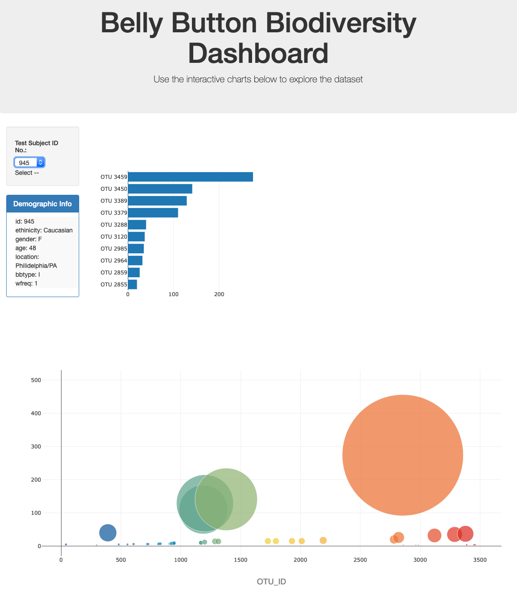

# plotly_challenge: Belly Button Biodiversity

In this exercise, I used Javascript in conjuction with HTML, D3 and CSS to read in a Json file and analyze and visualize the data therein.

### File Table of Contents
- app.js: contains d3 and javascript code used to read in the data, parse and iterate the data and visualize the data. Additionally, I commented out the console.logs I used to ensure that the data was being properly loaded.
- sample.json: contains the data used in this exercise.
- index.html: contains the html code used to visualize and display the data on an html webpage.

### Step 1: Read in Data
To do this I used d3.json. I created an annonymous function that would be used as the canvas where I would write code to create the dropdown selector.

### Step 2: Create the Dropdown Selector
The selector was used to choose between the participants in the study. To do this, I iteterated through the names object in the json using Javascript. I then pointed those names/ids to the dropdown selector in index.html.

### Step 3: Create an optionChange Function
This function will be used to filter the data to display only the data associated with the participant that was selected in the dropdown. This is where I would do the rest of my analysis and prepare the visualizations.

### Step 4: Create the Bar Chart
Created a horizontal bar chart using Plotly that works in conjuction with the dropdown menu to display the top 10 OTUs found in that individual.

* Used `sample_values` as the values for the bar chart.

* Used `otu_ids` as the labels for the bar chart.

* Used `otu_labels` as the hovertext for the chart.

### Step 5: Create the Bubble Chart
Created a bubble chart using Plotly that displays each sample for the participant that was selected from the dropdown.

* Use `otu_ids` for the x values.

* Use `sample_values` for the y values.

* Use `sample_values` for the marker size.

* Use `otu_ids` for the marker colors.

* Use `otu_labels` for the text values.

### Step 6: Create a Table to Display Metadata
Displayed the sample metadata, i.e., an individual's demographic information for the participant selected from the dropdown. I then displayed that data in the html webpage.
  

